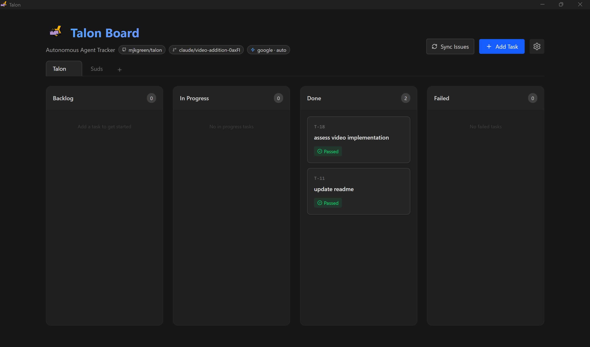
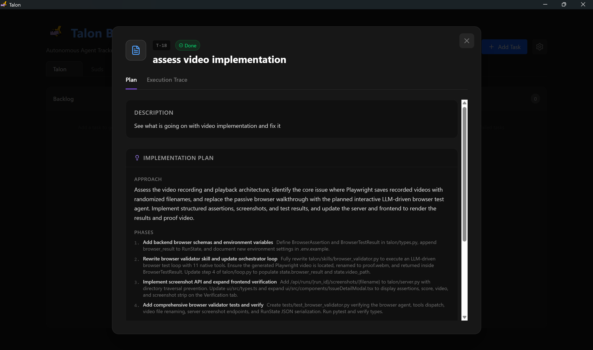
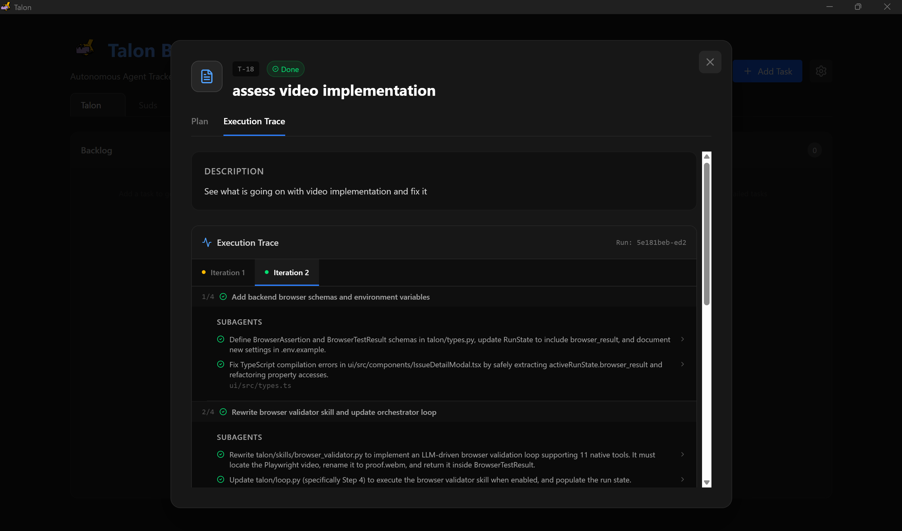
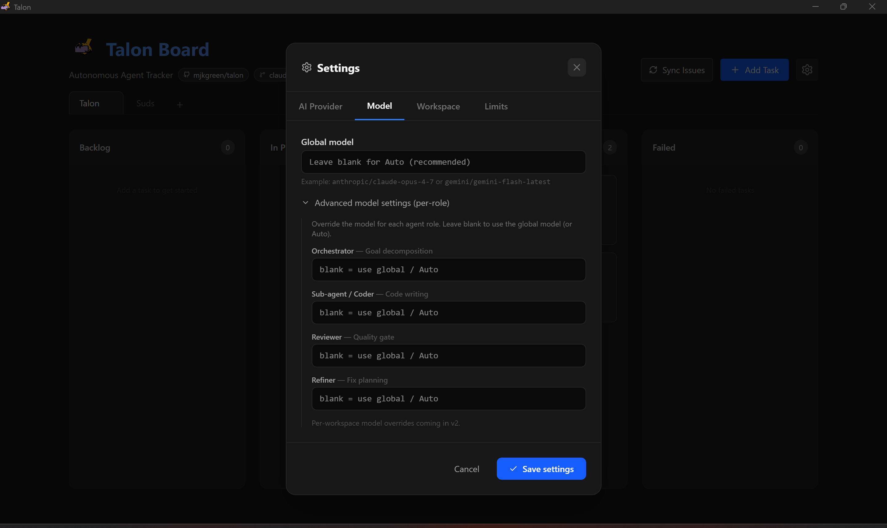

# talon-agent

Autonomous agentic coding system. Give it a goal; it decomposes the work into subtasks, runs parallel sub-agents to implement them, reviews the result, iterates until passing, records a video walkthrough, and posts to your Kanban board.

Available as a **desktop app** (Electron + bundled Python server) or as a standalone CLI/server.

[](https://github.com/mjkgreen/talon/releases/latest)

**[⬇ Download the latest release](https://github.com/mjkgreen/talon/releases/latest)**  
Windows `.exe` · macOS `.dmg` · Linux `.AppImage`

---

## Screenshots

| Board view | Task plan |
|:---:|:---:|
|  |  |

| Execution trace | Settings |
|:---:|:---:|
|  |  |

---

## How it works

```text
Goal
 │
 ▼
planner             Explores workspace → phased plan (approach, phases, success criteria)
 │                  [optional: stored in Backlog; user reviews/comments; plan is revised]
 ▼
task-executor       Iterates phases sequentially; runs N sub-agents in parallel per phase
 │                  Each run gets an isolated workspace (git worktree or copy)
 ▼
workspace-cleaner   Removes debug scripts and temp files before commit
 │
 ▼
reviewer            Reads files, runs tests, checks every success criterion; pass/fail + score
 │
 ├─ pass ─────────► pr-creator         Commits changes, pushes branch, opens GitHub PR
 │                       │
 │                       ▼
 │                  browser-validator  Records a Playwright screenshot/video walkthrough
 │                       │
 │                       ▼
 │                  board-updater      Posts result to Linear / GitHub Projects
 │
 └─ fail ─────────► refiner           Synthesises blocking issues → action plan
                         │
                         └──────────────► loops back to task-executor (next iteration)
```

### Agent roles

| Role | What it does |
|------|-------------|
| **Planner** | Explores the workspace with read-only tools, then outputs a structured multi-phase plan |
| **Task Executor** | Iterates phases sequentially; within each phase runs up to 7 sub-agents concurrently |
| **Sub-agents** | Each acts as an independent developer with read/write/shell tool access in an isolated workspace |
| **Workspace Cleaner** | LLM-assisted post-run cleanup: removes temp files, appends env files to `.gitignore` |
| **Reviewer** | Inspects modified files, runs test suites, evaluates against every success criterion |
| **Refiner** | Analyzes reviewer feedback and produces a revised action plan for the next iteration |
| **PR Creator** | After a passing run: commits changes, pushes an agent branch, opens a GitHub PR |
| **Browser Validator** | Playwright session: navigates the app, takes screenshots, records a `.webm` walkthrough |
| **Board Updater** | Posts run summaries and video links to Linear or GitHub Projects |

---

## Prerequisites

* **Python** ≥ 3.11 (tested on 3.11 and 3.12)
* **Git** — must be on `PATH` (required for workspace isolation via git worktrees)
* **OS** — macOS, Linux, or Windows. On Windows set `PYTHONUTF8=1`.
* **At least one LLM API key** — Anthropic, OpenAI, Gemini, Groq, Mistral, or Cohere (see [Configuration](#configuration))
* **Node.js ≥ 18 + npm ≥ 9** — only needed to build the React UI or Electron app from source
* **Playwright + Chromium** — only needed for the browser validator

---

## Installation

### CLI / Server (developer mode)

```bash
git clone https://github.com/mjkgreen/talon.git
cd talon
python -m venv venv
source venv/bin/activate          # Windows: .\venv\Scripts\Activate.ps1
pip install -e .                   # basic install
pip install -e ".[dev,browser]"    # + testing + Playwright
cp .env.example .env               # add your API keys
```

### Browser validator (optional)

```bash
pip install playwright
playwright install chromium
# then set BROWSER_VALIDATOR_ENABLED=true in .env
```

### Building the desktop app from source

```bash
# 1. Build React UI
cd ui && npm ci && npm run build && cd ..

# 2. Bundle Python server
pyinstaller talon-server.spec      # outputs dist/talon-server

# 3. Build Electron installer
cd electron && npm install
npm run build:mac    # or build:win / build:linux
```

Compiled installers land in `electron/release/`.

### GitHub OAuth (desktop app)

Register an OAuth App at `github.com/settings/developers`:
* Homepage URL: `http://localhost`
* Callback URL: `talon://oauth-callback`

Then add to `.env`:
```bash
GITHUB_CLIENT_ID=your_client_id_here
GITHUB_CLIENT_SECRET=your_client_secret_here
```

---

## CLI Usage

```bash
talon run "goal"                              # full agentic loop
talon run "goal" --working-dir ./my-project   # run against an existing codebase
talon run "goal" --url http://localhost:3000  # + Playwright browser validation
talon run "goal" --skip-board                 # skip Linear/GitHub board update
talon list                                    # show all runs and their statuses
talon review <run-id>                         # dump run state JSON
talon cleanup <run-id>                        # delete run workspace
talon pause <run-id>                          # request pause after current iteration
talon resume <run-id>                         # resume paused or failed run from checkpoint
talon retry <run-id>                          # alias for resume
talon serve [--port 8080]                     # start the Kanban UI + REST API server
```

### Workspace isolation

Every run gets its own sandboxed workspace so concurrent runs never conflict:

| `--working-dir` | Strategy |
|:---|:---|
| Not set | Fresh empty directory at `workspace/<run-id>/` |
| Plain directory | Full copy into `workspace/<run-id>/` |
| Git repository | `git worktree add` on branch `talon/<goal-slug>-<short-id>` |

On **pass**: workspace is kept for inspection; use `talon cleanup <run-id>` to remove it.  
On **fail**: workspace is deleted automatically.

### Pause and resume

A run can be paused between iterations:
```bash
talon pause <run-id>    # writes a pause signal; loop stops after current iteration
talon resume <run-id>   # reloads saved state and continues from last checkpoint
```

---

## Configuration

Set at least one LLM API key in `.env`. The system auto-selects the best available model for each role — no further configuration required.

```bash
# Minimum — pick one or more:
ANTHROPIC_API_KEY=sk-ant-...
OPENAI_API_KEY=sk-...
GEMINI_API_KEY=...
GROQ_API_KEY=...
MISTRAL_API_KEY=...
```

**Global override** (use one model for everything):
```bash
AGENT_MODEL=gemini/gemini-flash-latest
```

**Per-role override** (full control):
```bash
ORCHESTRATOR_MODEL=anthropic/claude-opus-4-7    # reasoning-heavy
SUBAGENT_MODEL=anthropic/claude-sonnet-4-6      # code writing
REVIEWER_MODEL=anthropic/claude-opus-4-7        # strict quality gate
REFINER_MODEL=anthropic/claude-sonnet-4-6       # synthesis
```

Auto-selection priority per role (first available provider wins):

| Role | Prefers |
|:---|:---|
| `orchestrator` | Opus → o3 → Gemini Pro → Sonnet |
| `subagent` | Sonnet → GPT-4o → Gemini Pro → Flash |
| `reviewer` | Opus → o3 → Gemini Pro → Sonnet |
| `refiner` | Sonnet → Flash → GPT-4o → Haiku |

See `.env.example` for the full list of variables (run limits, workspace paths, webhook secrets, etc.).

---

## Webhook server

Run `talon serve` to listen for incoming issues from Linear or GitHub and trigger agent runs automatically when the `agent-task` label is applied.

```
GET  /health    — liveness check
GET  /docs      — OpenAPI docs
POST /webhook/linear
POST /webhook/github
```

### Linear setup

1. **Linear** → Settings → API → Webhooks → Add Webhook
2. Endpoint: `https://your-domain.com/webhook/linear`
3. Set `LINEAR_WEBHOOK_SECRET` in `.env` to verify signatures
4. Label issues with `agent-task` (or set `WEBHOOK_LABEL`)

### GitHub setup

1. Repo → Settings → Webhooks → Add Webhook
2. Payload URL: `https://your-domain.com/webhook/github`
3. Content type: `application/json` · Events: **Issues**
4. Set `GITHUB_WEBHOOK_SECRET` in `.env`
5. Open issues with the `agent-task` label to trigger runs

---

## Changelog

### 0.6.0

**Workspace-exploring planner** — The planner now runs a full tool-use loop before producing a plan, using `list_files`, `read_file`, and `search_files` to understand the existing codebase. Configurable via `PLANNER_MAX_TURNS` (default 500).

**Phased execution** — The executor iterates through plan phases sequentially. Each phase receives aggregated output from prior phases as context. Sub-agents within a phase still run in parallel.

**Plan refinement** — Plans stored in Backlog can receive user feedback comments that the `plan_refiner` incorporates before execution starts.

**Workspace cleaner** — LLM-assisted post-run cleanup removes temp files and debug scripts before committing.

**PR creator** — After a passing run, changes are committed, a `talon/<goal-slug>` branch is pushed, and a GitHub PR is opened automatically.

**Pause / resume** — Runs can be paused between iterations and resumed from the last saved checkpoint.

**Incremental UI progress** — Phase-complete events are pushed over WebSocket in real time; the task detail panel updates as each phase finishes.

**Plan-aware reviewer** — The reviewer receives the full plan and verifies each success criterion explicitly.

**Branch selection** — Projects can target a specific GitHub branch; the branch is stored per-project and passed to `git clone --branch`.

**Goal-based branch naming** — Worktree and PR branches are named `talon/<goal-slug>-<short-id>` instead of generic `agent/run-<id>`.

**Windows UTF-8 fix** — CLI calls `SetConsoleOutputCP(65001)` before rewrapping stdout/stderr to prevent garbled Rich output.

---

### 0.5.x

- 0.5.2: fix reviewer JSON failures, raise tool turn limit, add limit hints in UI
- 0.5.1: bump version
- 0.5.0: bundle tiktoken/litellm/certifi data in PyInstaller exe; fix cl100k_base encoding

---

## Roadmap

- [ ] Browser validator: goal-specific navigation steps
- [ ] Board updater: GitHub Projects v2 API integration
- [ ] Webhook listener: auto-create project/issue from label without manual sync
- [ ] API rate limiting: `asyncio_throttle` for concurrent agent calls
- [ ] Automated test suite: expand unit and integration coverage
